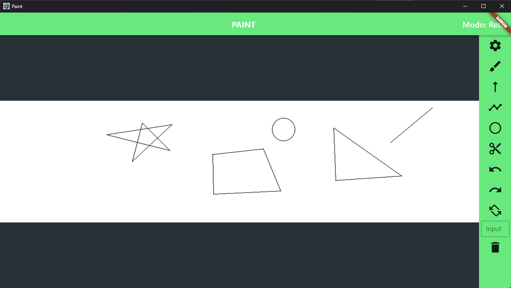

# Paint

## Introdução

Este programa aborda o desenvolvimento de algoritmos de computação gráfica, englobando técnicas de rasterização para desenho de retas (DDA, Bresenham) e circunferências (Bresenham), bem como algoritmos de recorte, incluindo regiões codificadas (Cohen-Sutherland) e equação paramétrica (Liang-Barsky).

**Rasterização**  
- Retas - DDA, Bresenham  
-  Circunferência - Bresenham  
  
**Recorte**  
- Regiões codificadas - Cohen-Sutherland  
- Equação paramétrica - Liang-Barsky  

## Janela Principal


## Instruções

1. Para navegar depois do zoom in você pode usar o botão do scroll ou o botão direito.
2. As ferramentas ja vem como default DDA e o Sutherland.
3. A ferramenta do pincel não está associada com as outras ferramentas, sendo possível apenas apagar.
4. As retas são geradas uma por vez na ferramenta de reta.
5. Na ferramenta de poligono é possivel gera diversas retas juntas formando objetos abertos e fechados, para começar outro objeto clique novamente na ferramenta do poligono.
6. Para criar a janela do recorte clique em pontos que gere uma diagonal principal (Esquerda para direita, cima baixo), caso queira deletar o retangulo do corte faça um retangulo com pontos na diagonal secundaria.
7. Todas as transformações geométricas são realizadas no ultimo objetos desenhado, pode ser reta ou poligono.
8. Exemplo de input das transformações geométricas.
   1. Translação: Clique em um novo local na tela.
   2. Rotação: Valor do angulo (90, 60).
   3. Escala: Fator escala, numero decimal.
   4. Reflexão: Eixos da reflexão (x, y, xy) em lowercase.  

## Path

- O projeto foi desenvolvido em flutter, por esse motivo os arquivos principais estão no path abaixo:
```
paint_algorithm/lib/*.
```
- Os arquivos contendo o algoritmos estão no mesmo path porem na pasta algoritmo:
```
paint_algorithm/lib/algorithms/*.
```

## Arquivo Executável (Build para Windows)
O executável está nas releases do github mas também pode ser rápidamente acessado.  
Baixe o executável no link abaixo, descompacte o arquivo e execute o **paint.exe** dentro da pasta Release.

<center>
<a style="font-size: 20px;" href="https://github.com/viniciushgiovanini/paint-computer-graphics/releases/download/v1.0/Release.zip">DOWNLOAD</a>
</center>

## Link para o repositório do GitHub
<center>
<a style="font-size: 20px;" href="https://github.com/viniciushgiovanini/paint-computer-graphics">Repositório GitHub</a>
</center>


## Linguagens de Programação

&nbsp;


---

## Desenvolvimento ✏

**Feito por**:
- [Vinícius Henrique Giovanini](https://github.com/viniciushgiovanini)  
